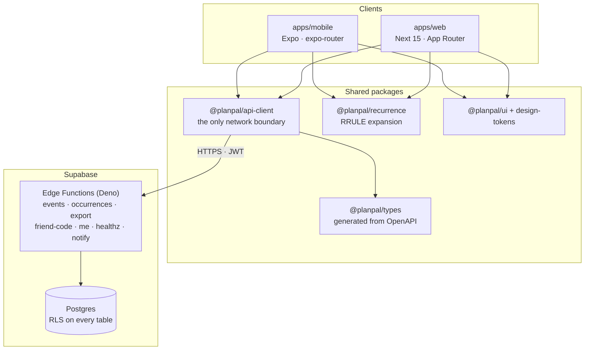

# PlanPal

A calendar app with a one-way social sharing layer — share what you're busy
with, at the granularity you choose, without handing over your whole calendar.

**[▶ Try the live demo](https://REPLACE_WITH_DEMO_URL.invalid)** — one click, no registration.
Signs in as `demo@planpal.app` / `planpal-demo` with sample data.

[](https://github.com/firegiant9000/PlanPal/actions/workflows/ci.yml)


|                                              |                                              |
| -------------------------------------------- | -------------------------------------------- |
|  |  |

Expo (iOS/Android) and Next.js (web) share one TypeScript core, against a
Supabase backend — Postgres with row-level security, and a Deno Edge Function
API described by an OpenAPI contract.

## How it works



No UI component talks to the network. Both apps go through
`@planpal/api-client`, which is the single place a request is constructed —
enforced by a lint rule, not by convention.

## Engineering notes

Things in here I'd point at in a code review:

- **The API contract is the source of truth, and CI enforces it.**
  [`openapi.yaml`](packages/api-contract) generates
  [`packages/types/src/generated/openapi.ts`](packages/types/src/generated),
  and [`contract.yml`](.github/workflows/contract.yml) regenerates it on every
  PR and fails on `git diff --exit-code`. A hand-edited type cannot survive a
  merge.
- **A deploy that silently did nothing fails the build.**
  [`deploy-staging.yml`](.github/workflows/deploy-staging.yml) stamps the
  commit SHA into the deployed functions, then requires `/healthz` to return
  200, `"status":"ok"`, _and_ that exact version — because a no-op functions
  deploy otherwise leaves the previous build answering healthily.
- **Row-level security on every table in `public`, with the one exception made
  explicit.** All seven have `rowsecurity` on. Six carry explicit policies;
  `notification_sends` is scheduler bookkeeping and deliberately has _none_,
  which denies every role that cannot bypass RLS. A test asserts that
  distinction both ways, so adding a policy there fails the build — see
  [`grants.test.ts`](supabase/tests/src) and
  [`core_schema.sql`](supabase/migrations).
- **Recurrence is a real engine, not a `for` loop.**
  [`packages/recurrence`](packages/recurrence) expands RRULEs with timezone
  handling, per-occurrence overrides, and cancellations. Its suite runs under
  `node --test` with coverage floors of 90% lines, 90% functions and 85%
  branches, enforced in the test command itself.
- **One design system, two renderers.**
  [`@planpal/design-tokens`](packages/design-tokens) is framework-agnostic
  plain values consumed by both React Native and the DOM, so a spacing change
  lands on both platforms at once.
- **Timezone correctness is tested as a property.** Events store local
  wall-clock time plus a timezone id, with UTC derived by trigger — see
  [`utc-authority.test.ts`](supabase/tests/src).

## Status

Honest about where this is. It's an active build, not a finished product.

| Area                                                                                                          | State                                                                                                                       |
| ------------------------------------------------------------------------------------------------------------- | --------------------------------------------------------------------------------------------------------------------------- |
| Calendar — month/week views, event CRUD, recurrence                                                           | Working on web and mobile                                                                                                   |
| Auth — email/password, session persistence                                                                    | Working                                                                                                                     |
| Auth — Google / Apple OAuth                                                                                   | Buttons ship disabled; the PKCE exchange is unimplemented and [documented in-code](apps/web/src/app/auth/callback/page.tsx) |
| API — 7 Deno Edge Functions, JWT-verified                                                                     | Built; linted, type-checked and exercised over HTTP by the integration suite in CI                                          |
| Friend connections and shared visibility                                                                      | Schema and API done; no UI yet                                                                                              |
| AI screenshot import                                                                                          | Designed, not built                                                                                                         |
| Push notifications                                                                                            | Scheduler function built; device delivery gated on hardware testing                                                         |
| CI — lint, typecheck, test, build, Expo pin check, recurrence mirror, Edge Function checks, integration suite | Running on every PR                                                                                                         |
| Contract drift gate                                                                                           | Separate workflow, every PR                                                                                                 |
| Deploy                                                                                                        | Automated on merge to `main`, _when_ the `staging` environment secrets are set; skips with a notice when they are not       |

The demo runs against a disposable Supabase project that is reseeded nightly,
kept separate from the development project so active migrations can't break
the link.

## Running it locally

Needs Node 22, pnpm 9, and Docker.

```bash
nvm use && corepack enable
pnpm install
cp .env.example .env      # see docs/SECRETS.md
pnpm db:start && pnpm db:reset
pnpm dev
```

That seeds two local accounts, `alice@example.com` and `scott@example.com`,
both with password `password123`.

Full setup, repo layout and the migration strategy:
[docs/BOOTSTRAP.md](docs/BOOTSTRAP.md).

```bash
pnpm lint         # eslint across the workspace
pnpm typecheck    # tsc across the workspace
pnpm test         # unit tests
pnpm test:integration   # Edge Functions + SQL, needs the local stack up
pnpm build        # packages + web
```

## Layout

```
apps/web                Next.js (App Router)
apps/mobile             Expo / React Native (expo-router)
packages/api-client     the only network boundary
packages/api-contract   OpenAPI spec — the integration contract
packages/types          shared types, generated from the contract
packages/recurrence     RRULE expansion engine
packages/calendar-core  date/grid logic shared by both apps
packages/ui             shared component contracts + theme
packages/design-tokens  design system primitives
packages/analytics      typed KPI event contracts
supabase/functions      the API — Edge Functions (Deno)
supabase/migrations     schema, RLS policies
```

More: [architecture and runbook](docs/BOOTSTRAP.md) ·
[environments](docs/ENVIRONMENTS.md) · [test strategy](docs/TESTING.md) ·
[metrics](docs/METRICS.md) · [planning archive](docs/planning)

## Licence

MIT — see [LICENSE](LICENSE).
