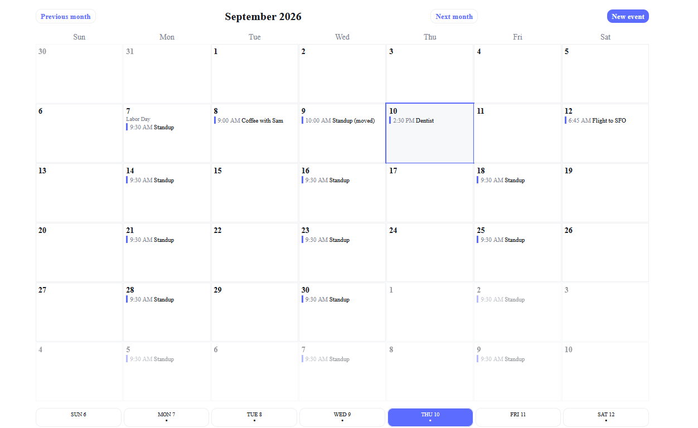
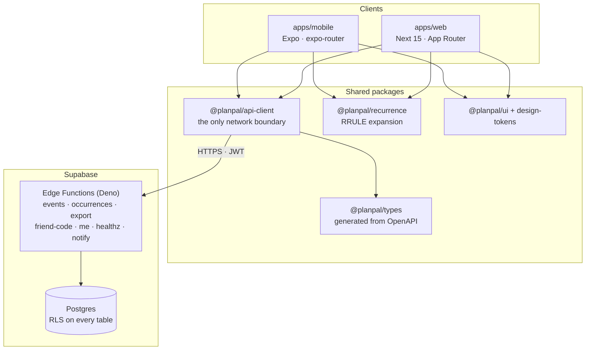

# PlanPal

A calendar app with a one-way social sharing layer — share what you're busy
with, at the granularity you choose, without handing over your whole calendar.

**[▶ Try the live demo](https://planpal-iota.vercel.app)** — one click, no registration.
Signs in as `demo@planpal.app` / `planpal-demo` with sample data.

[](https://github.com/firegiant9000/PlanPal/actions/workflows/ci.yml)



Expo (iOS/Android) and Next.js (web) share one TypeScript core, against a
Supabase backend — Postgres with row-level security, and a Deno Edge Function
API described by an OpenAPI contract.

## How it works



No UI component talks to the network. Both apps go through
`@planpal/api-client`, which is the single place a request is constructed —
enforced by a lint rule, not by convention.

## Engineering notes

Things in here I'd point at in a code review:

- **The API contract is the source of truth, and CI enforces it.**
  [`openapi.yaml`](packages/api-contract) generates
  [`packages/types/src/generated/openapi.ts`](packages/types/src/generated),
  and [`contract.yml`](.github/workflows/contract.yml) regenerates it on every
  PR and fails on `git diff --exit-code`. A hand-edited type cannot survive a
  merge.
- **A deploy that silently did nothing fails the build.**
  [`deploy-staging.yml`](.github/workflows/deploy-staging.yml) stamps the
  commit SHA into the deployed functions, then requires `/healthz` to return
  200, `"status":"ok"`, _and_ that exact version — because a no-op functions
  deploy otherwise leaves the previous build answering healthily.
- **Row-level security on every table in `public`, with the exceptions made
  explicit.** All ten tables have `rowsecurity` on. Eight carry explicit
  policies; `notification_sends` and `parse_spend_ledger` are bookkeeping and
  deliberately have _none_, which denies every role that cannot bypass RLS. A
  test asserts that distinction both ways for the tables it covers, so adding
  a policy there fails the build — see
  [`grants.test.ts`](supabase/tests/src) and
  [`core_schema.sql`](supabase/migrations). The RLS story is owner-only
  today; the cross-user proof (friend, stranger, blocked, revoked) is roadmap
  milestone P2.
- **Recurrence is a real engine, not a `for` loop.**
  [`packages/recurrence`](packages/recurrence) expands RRULEs with timezone
  handling, per-occurrence overrides, and cancellations. Its suite runs under
  `node --test` with coverage floors of 90% lines, 90% functions and 85%
  branches, enforced in the test command itself.
- **One design system, two renderers.**
  [`@planpal/design-tokens`](packages/design-tokens) is framework-agnostic
  plain values consumed by both React Native and the DOM, so a spacing change
  lands on both platforms at once.
- **Timezone correctness is tested against Postgres.** Events store local
  wall-clock time plus a timezone id, with UTC derived by trigger; a fixed set
  of (local, zone) pairs including the DST gap and fold is checked against the
  database — see [`utc-authority.test.ts`](supabase/tests/src). These are
  hand-written cases, not generated properties; differential property tests
  against rrule.js are roadmap milestone P3.

## Status

Honest about where this is. It's an active build, not a finished product.

| Area                                                                                                          | State                                                                                                                                                                                                                                          |
| ------------------------------------------------------------------------------------------------------------- | ---------------------------------------------------------------------------------------------------------------------------------------------------------------------------------------------------------------------------------------------- |
| Calendar — month/week views, event CRUD, recurrence                                                           | Working on web, confirmed in a browser against the seeded stack. Mobile shares the same client and is green in CI, but has not been watched render on a device                                                                                 |
| Auth — email/password, session persistence                                                                    | Working                                                                                                                                                                                                                                        |
| Auth — Google / Apple OAuth                                                                                   | Buttons ship disabled; the PKCE exchange is unimplemented and [documented in-code](apps/web/src/app/auth/callback/page.tsx)                                                                                                                    |
| API — 10 Deno Edge Functions, JWT-verified                                                                    | Built; linted, type-checked and exercised over HTTP by the integration suite in CI                                                                                                                                                             |
| Friend connections and shared visibility                                                                      | Schema and friend-code endpoints only. The nine friend/share operations in the contract have no implementation, client or UI yet; building them is roadmap milestone P1 (see [docs/roadmap-review-2026-09.md](docs/roadmap-review-2026-09.md)) |
| AI screenshot import                                                                                          | Pipeline built end to end — upload, OCR, LLM extraction, normalisation, conflict detection, spend ledger — on a cron worker. No UI wired yet                                                                                                   |
| In-app feedback                                                                                               | API, client and form components built and tested; not yet reachable from either app's navigation                                                                                                                                               |
| Push notifications                                                                                            | Scheduler function built; device delivery gated on hardware testing                                                                                                                                                                            |
| CI — lint, typecheck, test, build, Expo pin check, recurrence mirror, Edge Function checks, integration suite | Running on every PR                                                                                                                                                                                                                            |
| Contract drift gate                                                                                           | Separate workflow, on every PR that touches the contract, types or generated files, and on every push to `main`                                                                                                                                |
| Deploy                                                                                                        | Web via Vercel's GitHub integration — production on merge, a preview per PR. Backend on merge to `main`, _when_ the `staging` environment secrets are set; skips with a notice when they are not                                               |

The demo runs against the staging Supabase project, reseeded nightly. It is
separate from the local development stack, but it is the same project that
`deploy-staging.yml` migrates on every merge to `main`, so a bad migration
can reach the demo.

**Direction (2026-09):** PlanPal is a personal calendar and a technical
showcase, not a launch. The next work is sharing end to end with cross-user
RLS proof, differential recurrence tests, and an ICS feed. See the 2026-09
revision at the top of
[docs/planning/DEVELOPMENT_PLAN.md](docs/planning/DEVELOPMENT_PLAN.md).

## Running it locally

Needs Node 22, pnpm 9, and Docker.

```bash
nvm use && corepack enable
pnpm install
cp .env.example .env      # see docs/SECRETS.md
pnpm db:start && pnpm db:reset
```

`pnpm db:start` prints the local stack's URL and anon key. The web app reads
env from its own directory rather than the repo root, so put those two values
in `apps/web/.env.local` (gitignored) before starting it:

```bash
NEXT_PUBLIC_SUPABASE_URL=http://127.0.0.1:54321
NEXT_PUBLIC_SUPABASE_ANON_KEY=<the ANON_KEY printed above>
```

```bash
pnpm dev
```

That seeds two local accounts, `alice@example.com` and `scott@example.com`,
both with password `password123`.

Full setup, repo layout and the migration strategy:
[docs/BOOTSTRAP.md](docs/BOOTSTRAP.md).

```bash
pnpm lint         # eslint across the workspace
pnpm typecheck    # tsc across the workspace
pnpm test         # unit tests
pnpm test:integration   # Edge Functions + SQL, needs the local stack up
pnpm build        # packages + web
```

## Layout

```
apps/web                Next.js (App Router)
apps/mobile             Expo / React Native (expo-router)
packages/api-client     the only network boundary
packages/api-contract   OpenAPI spec — the integration contract
packages/types          shared types, generated from the contract
packages/recurrence     RRULE expansion engine
packages/calendar-core  date/grid logic shared by both apps
packages/ui             shared component contracts + theme
packages/design-tokens  design system primitives
packages/analytics      typed KPI event contracts
supabase/functions      the API — Edge Functions (Deno)
supabase/migrations     schema, RLS policies
```

More: [architecture and runbook](docs/BOOTSTRAP.md) ·
[environments](docs/ENVIRONMENTS.md) · [test strategy](docs/TESTING.md) ·
[metrics](docs/METRICS.md) · [planning archive](docs/planning)

## Who built it

Two people. [Arlo Kharod](https://github.com/firegiant9000) set up the
monorepo and the OpenAPI contract, and wrote most of the schema, RLS policies
and their tests, the Edge Functions, the web and mobile apps, CI, and the
deploy and demo pipelines. [Scott Williams](https://github.com/Scottw985)
delivered the Month 2 milestone (the first recurrence engine, backend APIs
and mobile calendar), the Month 5 screenshot-parse pipeline and feedback
feature, and reviewed and merged pull requests. The planning archive in
[docs/planning](docs/planning) records the intended split, month by month;
`git log` records what actually landed.

## Licence

MIT — see [LICENSE](LICENSE).
